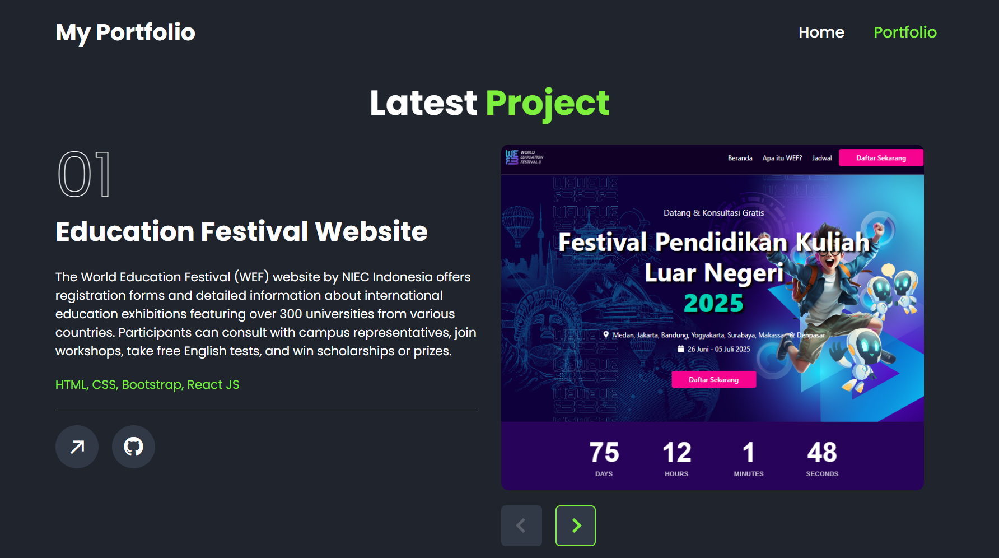

# PORTFOLIO WEBSITE 2025

For this project, I created a specialized website showcasing my work results and all my best projects displayed on this portfolio web. I built it using the simplest approach, utilizing HTML, CSS, and basic JS, as this aligns with its purpose of displaying images and serving as a basic informational website.

## Project Structure

This project consists of:
- **1 index.html file** - Main entry point for the website
- **CSS folder** containing style.css - All styling components
- **JS folder** containing script.js - Interactive functionality
- **Images folder** - Contains all visual assets to be used

## Features
- Responsive design
- Project showcase
- Skills display
